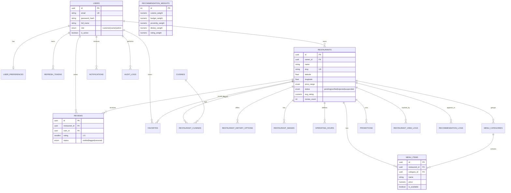

# Database Schema — Cordova Local Restaurant Recommendation System

Target engine: **PostgreSQL 14+** (primary). A MySQL 8+ compatibility note is
included at the bottom for teams that must use MySQL per the proposal's
"MySQL / PostgreSQL" stack line.

## Entity Relationship Diagram



## Design Notes & Rationale

- **Single `users` table with a `role` enum** rather than separate tables per
  actor. Simpler auth/JWT logic; owner- and admin-specific data lives in
  their own related tables (`restaurants.owner_id`, `audit_logs.actor_id`)
  rather than duplicating user fields.
- **`restaurants.status`** implements the "Business permit & registration
  verification" admin use case: `pending → verified` or `pending → rejected`,
  with `rejection_reason` and `verified_by`/`verified_at` for accountability.
  `suspended` supports admin moderation after the fact.
- **`avg_rating` / `review_count` are denormalized** onto `restaurants` and
  kept in sync via the `recalc_restaurant_rating()` trigger, because every
  restaurant list/search view needs them and recomputing an AVG() over
  reviews on every list request doesn't scale.
- **`recommendation_weights`** is a single-row-active configuration table
  that implements the "Update AI Model" admin use case without needing real
  ML infrastructure — admins tune the rule-based scoring weights (see
  `docs/API.md` → Recommendation Engine).
- **`recommendation_logs` / `restaurant_view_logs`** feed the "Admin: System-
  wide analytics" and "Owner: views, clicks & recommendation frequency"
  features. `query_params` is JSONB so new filter types don't require a
  migration.
- **Indexes**: FK columns are indexed for join performance; `restaurants`
  has a composite lat/lng index for bounding-box pre-filtering before the
  more expensive Haversine distance calculation, plus a trigram GIN index
  on `name` for fast fuzzy search-as-you-type.
- **Constraints**: `CHECK` constraints enforce rating range (1-5), promotion
  date ordering, and non-negative prices at the database level (defense in
  depth beyond application-layer validation).

## Migrations

| File | Purpose |
|---|---|
| `migrations/001_initial_schema.sql` | All extensions, enums, tables, indexes, triggers |
| `migrations/002_reference_data.sql` | Cuisine lookup values + default AI weight profile (idempotent) |

Run with the Node `pg` client via `npm run db:migrate` (see backend README),
or directly:

```bash
psql "$DATABASE_URL" -f database/migrations/001_initial_schema.sql
psql "$DATABASE_URL" -f database/migrations/002_reference_data.sql
psql "$DATABASE_URL" -f database/seed.sql   # optional, dev/demo only
```

## MySQL compatibility notes

If your team must target MySQL 8 instead of PostgreSQL:

- Replace `UUID DEFAULT uuid_generate_v4()` with `CHAR(36)` and generate
  UUIDs in the application layer (MySQL has no native UUID default gen).
- Replace native `ENUM` types with `VARCHAR` + `CHECK` constraint, or
  MySQL's inline `ENUM(...)` column syntax (loses reusability across tables).
- Replace `TEXT[]` / `service_type[]` array columns (`preferred_cuisines`,
  `services_offered`, `dietary_restrictions`, `result_ids`) with a proper
  join table (e.g. `restaurant_services(restaurant_id, service)`) since
  MySQL has no array type — this is actually the more normalized approach.
- Replace `JSONB` with MySQL's `JSON` type (functionally similar).
- Replace `gin_trgm_ops` full-text/fuzzy index with a MySQL `FULLTEXT` index
  on `name`.
- Triggers use the same `BEFORE UPDATE` / `AFTER INSERT OR UPDATE OR DELETE`
  concepts but MySQL syntax differs (`DELIMITER //` blocks); logic is
  otherwise portable.
